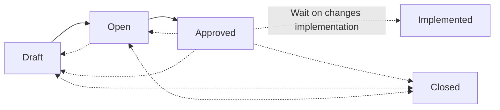

## What are Schema Proposals?

Schema proposals are an API governance process that shift schema design left, to earlier in your
development flow. They allow team members to suggest changes to the schema before any code changes.

The way this works is by storing a list of approved changes, and then verifying any new changes
against this list as part of the usual schema check flow. This way, only approved changes can be
implemented.

There's lots more to it than that. But luckily you shouldn't have to worry all those details. Let's
look at what's planned for Schema Proposals in Hive.

### Schema Proposal Lifecycle

Schema proposals are manually transitioned from Draft to Open to Approved and potentially back or to
Closed. However, once a proposal is Approved, the set of changes must be matched against published
schemas before finally being transitioned to Implemented once all changes are accounted for. An
important detail is that a proposal doesn't need implemented all at once. A subset of changes can be
completed at a rate that is comfortable to your team.

## Feature Details

### Detailed list of Changes

Much like the existing list of changes inside schema checks, this view gives a concise list of
changes and includes some metadata for each change, such as whether or not the change is breaking,
and for Schema Proposals, whether not a change conflicts with the latest schema. For example, if a
proposal adds field to an existing type, but that type gets removed before the proposal can be
implemented.

### Minimal Schema Diff

Showing a diff of the schema definition language (SDL) gives a clear picture of what your schema
will look like. For this view, we opted to not using existing string diffing options that are
typically used. This helps keep te rendered diff concise since we can control formatting and
ordering to avoid unnecessary noise for example, when changing the order of definitions in your SDL.

If using GraphQL Federation, then each subgraph will be rendered separately on this view:

A separate view is available to see the diff for the entire supergraph. This is helpful for
confirming how subgraphs combine.

### Schema Checks

Schema Proposals are implemented on top of an existing feature -- Schema Checks. Every proposed
change to a graph will trigger a schema check and those are all tracked in this view. This is also a
history of all the proposed versions of a proposal.

### Reviews and Comments

A critical part of proposals is giving team members an opportunity to comment on the changes. This
collaboration is key to producing high quality APIs. We plan to fully support adding comments to
parts of the schema for detail and to the proposal on a whole for general statements about the
entire effort.

---

Schema proposals are scheduled to be released later this year.

We hope you enjoyed this preview of our work. If you have any feedback or additional requests, then
please don't hesitate to contact us via Slack or chat with us through our website.
